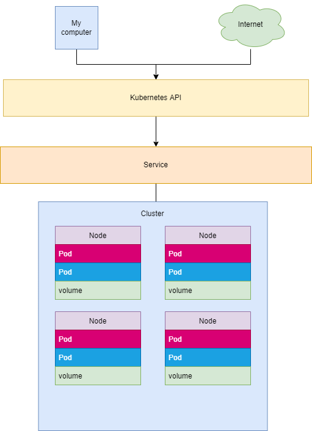

## Exercise 3.08

Computer and internet are connected to the kubernetes API which has access to the services. Services allow the machine to have access to nodes that are inside the kubernetes container. In these nodes there are pods that are sets of running containers in the cluster and volume that are directories of data that are accessable by the pods of the node.

